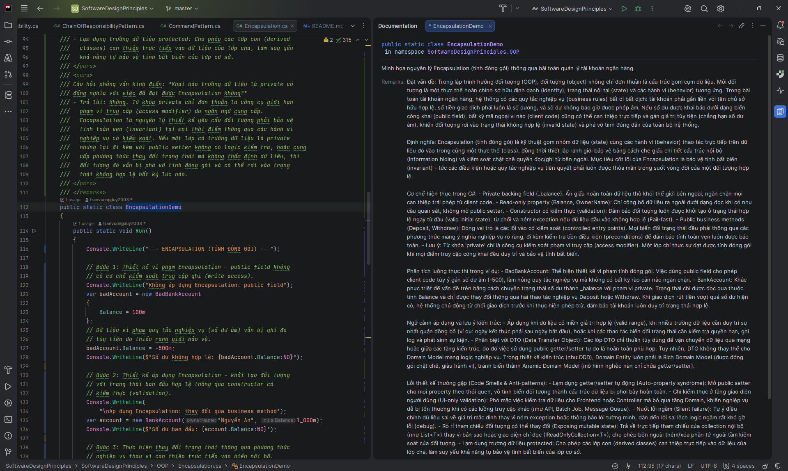

# 📐 Các Nguyên Tắc Thiết Kế Phần Mềm

Tài liệu tham khảo thực hành bằng C# / .NET 10 về **nền tảng OOP**, **nguyên tắc SOLID** và toàn bộ **23 mẫu thiết kế Gang-of-Four** — được xây dựng phục vụ cho việc học tập và ôn tập phỏng vấn.

Chạy ứng dụng console tương tác để khám phá từng khái niệm với các demo rõ ràng, độc lập mà bạn có thể đọc, chạy và debug.

---

## 📚 Nội Dung

### OOP — Lập Trình Hướng Đối Tượng
| # | Nguyên tắc | Mã nguồn |
|---|------------|-----------|
| 1 | Đóng gói (Encapsulation) | [`Encapsulation.cs`](OOP/Encapsulation.cs) |
| 2 | Kế thừa (Inheritance) | [`Inheritance.cs`](OOP/Inheritance.cs) |
| 3 | Đa hình (Polymorphism) | [`Polymorphism.cs`](OOP/Polymorphism.cs) |
| 4 | Trừu tượng (Abstraction) | [`Abstraction.cs`](OOP/Abstraction.cs) |

### Nguyên Tắc SOLID
| # | Nguyên tắc | Mã nguồn |
|---|------------|-----------|
| 1 | Nguyên tắc Đơn Nhiệm (SRP) | [`SingleResponsibility.cs`](SOLID/SingleResponsibility.cs) |
| 2 | Nguyên tắc Đóng/Mở (OCP) | [`OpenClosed.cs`](SOLID/OpenClosed.cs) |
| 3 | Nguyên tắc Thay thế Liskov (LSP) | [`LiskovSubstitution.cs`](SOLID/LiskovSubstitution.cs) |
| 4 | Nguyên tắc Phân tách Interface (ISP) | [`InterfaceSegregation.cs`](SOLID/InterfaceSegregation.cs) |
| 5 | Nguyên tắc Đảo ngược Phụ thuộc (DIP) | [`DependencyInversion.cs`](SOLID/DependencyInversion.cs) |

### Vòng Đời Dịch Vụ Trong Dependency Injection (DI)
| # | Vòng đời (Lifetime) | Mã nguồn |
|---|----------------------|-----------|
| 1 | Transient Lifetime | [`Transient.cs`](DependencyInjection/Transient.cs) |
| 2 | Scoped Lifetime | [`Scoped.cs`](DependencyInjection/Scoped.cs) |
| 3 | Singleton Lifetime | [`Singleton.cs`](DependencyInjection/Singleton.cs) |

### Mẫu Thiết Kế — Khởi Tạo (Creational)
| # | Mẫu | Mã nguồn |
|---|------|-----------|
| 1 | Singleton | [`SingletonPattern.cs`](DesignPatterns/CreationalPatterns/SingletonPattern.cs) |
| 2 | Factory Method | [`FactoryMethodPattern.cs`](DesignPatterns/CreationalPatterns/FactoryMethodPattern.cs) |
| 3 | Abstract Factory | [`AbstractFactoryPattern.cs`](DesignPatterns/CreationalPatterns/AbstractFactoryPattern.cs) |
| 4 | Builder | [`BuilderPattern.cs`](DesignPatterns/CreationalPatterns/BuilderPattern.cs) |
| 5 | Prototype | [`PrototypePattern.cs`](DesignPatterns/CreationalPatterns/PrototypePattern.cs) |

### Mẫu Thiết Kế — Cấu Trúc (Structural)
| # | Mẫu | Mã nguồn |
|---|------|-----------|
| 1 | Adapter | [`AdapterPattern.cs`](DesignPatterns/StructuralPatterns/AdapterPattern.cs) |
| 2 | Bridge | [`BridgePattern.cs`](DesignPatterns/StructuralPatterns/BridgePattern.cs) |
| 3 | Composite | [`CompositePattern.cs`](DesignPatterns/StructuralPatterns/CompositePattern.cs) |
| 4 | Decorator | [`DecoratorPattern.cs`](DesignPatterns/StructuralPatterns/DecoratorPattern.cs) |
| 5 | Facade | [`FacadePattern.cs`](DesignPatterns/StructuralPatterns/FacadePattern.cs) |
| 6 | Flyweight | [`FlyweightPattern.cs`](DesignPatterns/StructuralPatterns/FlyweightPattern.cs) |
| 7 | Proxy | [`ProxyPattern.cs`](DesignPatterns/StructuralPatterns/ProxyPattern.cs) |

### Mẫu Thiết Kế — Hành Vi (Behavioral)
| # | Mẫu | Mã nguồn |
|---|------|-----------|
| 1 | Chain of Responsibility | [`ChainOfResponsibilityPattern.cs`](DesignPatterns/BehavioralPatterns/ChainOfResponsibilityPattern.cs) |
| 2 | Command | [`CommandPattern.cs`](DesignPatterns/BehavioralPatterns/CommandPattern.cs) |
| 3 | Iterator | [`IteratorPattern.cs`](DesignPatterns/BehavioralPatterns/IteratorPattern.cs) |
| 4 | Mediator | [`MediatorPattern.cs`](DesignPatterns/BehavioralPatterns/MediatorPattern.cs) |
| 5 | Memento | [`MementoPattern.cs`](DesignPatterns/BehavioralPatterns/MementoPattern.cs) |
| 6 | Observer | [`ObserverPattern.cs`](DesignPatterns/BehavioralPatterns/ObserverPattern.cs) |
| 7 | State | [`StatePattern.cs`](DesignPatterns/BehavioralPatterns/StatePattern.cs) |
| 8 | Strategy | [`StrategyPattern.cs`](DesignPatterns/BehavioralPatterns/StrategyPattern.cs) |
| 9 | Template Method | [`TemplateMethodPattern.cs`](DesignPatterns/BehavioralPatterns/TemplateMethodPattern.cs) |
| 10 | Visitor | [`VisitorPattern.cs`](DesignPatterns/BehavioralPatterns/VisitorPattern.cs) |

---

## 🚀 Bắt Đầu

### Yêu cầu

- [.NET 10 SDK](https://dotnet.microsoft.com/download/dotnet/10.0) trở lên

### Chạy ứng dụng

```bash
dotnet run
```

Menu tương tác sẽ hiện ra — chọn số để chạy demo bất kỳ, hoặc nhấn `0` để chạy tất cả lần lượt.

---

### Cách đọc tài liệu

Sử dụng `Documentation Tool Window` của `JetBrains Rider` để có trải nghiệm đọc tốt nhất:



---

## 🗂️ Cấu Trúc Dự Án

```
software-design-principles/
├── OOP/                          # 4 trụ cột OOP
├── SOLID/                        # 5 nguyên tắc SOLID
├── DesignPatterns/
│   ├── CreationalPatterns/       # 5 mẫu khởi tạo
│   ├── StructuralPatterns/       # 7 mẫu cấu trúc
│   └── BehavioralPatterns/       # 10 mẫu hành vi
├── Program.cs                    # Menu console tương tác
└── SoftwareDesignPrinciples.csproj
```

---

## 🤝 Đóng Góp

Mọi đóng góp đều được chào đón! Hãy tạo issue hoặc gửi pull request nếu bạn muốn thêm ví dụ, cải thiện giải thích hoặc sửa lỗi.

---

## 📄 Giấy Phép

Dự án này được cấp phép theo [Giấy phép MIT](LICENSE).
